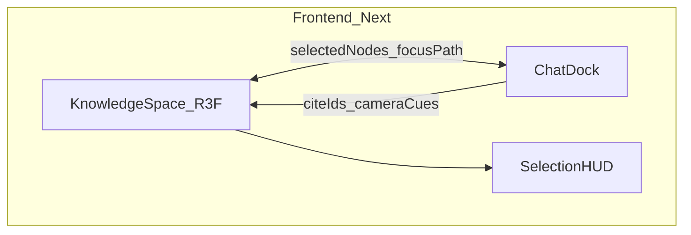

# Interaction — Knowledge Space (R3F)

Chosen UX: a **bespoke React Three Fiber knowledge space**, not a stock force-graph widget. The portfolio graph is a navigable 3D world the visitor explores and the AI can pilot.

Decision: option **#3** from the visualization research (big + beautiful). Underlying force layout may still use `r3f-forcegraph` / `three-forcegraph` inside the scene, but the product surface is an authored R3F experience — lighting, camera, postprocessing, spatial regions, and custom node objects.

## Product stance

- The knowledge space is a **primary surface**, not a side panel demo.
- Chat and graph are **coupled**: selection feeds the assistant; answers light paths and move the camera.
- Feel targets: zoom/orbit, depth, intentional motion, type-specific 3D totems (and optional emoji/billboard glyphs as type markers — not decoration on every edge).

## Scene structure



### Spatial regions (clusters)

Hand-authored or soft-bounded regions so the world reads as places, not only a hairball:

| Region | Graph content |
| --- | --- |
| Experience | Roles, orgs, skills, career narrative anchors |
| Projects | Projects, tech edges, outcomes |
| Music | Mixes, tracks, creative domain nodes |
| About / Contact | Meta nodes, how-to-reach (sparse) |

Force simulation may run **within** a region or as a gentle global layout with region attractors — not an unconstrained dump of every node into one cloud.

### Node visuals

- Default: small branded meshes / low-poly totems per `node_kind` (`Person`, `Project`, `Tech`, `Media`, …).
- Optional: billboard emoji or icon sprites as **type markers** (e.g. mix vs tech), used sparingly.
- Selected / cited / contradicted states get distinct materials or emissive cues (tie to validity telemetry later).
- Connectors: restrained; emphasize the active retrieval path over the full edge set when an answer is showing.

### Camera and motion (ship 2–3 intentional motions)

1. **Idle drift** — slow orbital or ambient motion so the space feels alive.
2. **Focus fly-to** — ease camera to a clicked or AI-cited node / path.
3. **Region transition** — when intent implies a domain (e.g. `MEDIA_SEARCH`), ease toward that region.

Avoid noisy particle spam; motion is hierarchy and presence.

## Visitor ↔ AI loop

1. Visitor pans / zooms / clicks nodes (multi-select allowed within a small cap).
2. Selection becomes **chat context** (node ids, kinds, labels) — slots for intent classification.
3. Visitor asks a question (with or without prior selection).
4. Orchestrator retrieves; response includes `citations` (graph + vector ids) and optional `camera` cues.
5. Knowledge space **highlights** supporting nodes/edges, dims the rest, and flies along the cite path.
6. Stage A strip/conflict can pulse or mark nodes that were withheld (advanced; v1 may only highlight supported cites).

## Tech stack (frontend slice)

| Piece | Choice |
| --- | --- |
| Renderer | `@react-three/fiber` + `three` |
| Helpers | `@react-three/drei` (controls, HTML/billboards, staging) |
| Graph physics (optional) | `r3f-forcegraph` or equivalent inside the Canvas |
| Motion | `@react-spring/three` and/or camera-controls easings |
| Postprocessing | Light depth / bloom only if it stays readable on mobile |
| Next.js | Client-only Canvas (`dynamic` / `ssr: false`); respect reduced-motion |

## Data contract for the scene

Graph payload for the client (from seed or API):

```text
nodes: { id, kind, label, region, totem?, emoji?, val? }[]
edges: { id, source, target, rel }[]
```

Chat completion may add:

```text
camera?: { focus_node_ids: string[], mode: "fly_to" | "fit_path" | "region" }
highlight?: { node_ids: string[], edge_ids: string[] }
```

See [api.md](./api.md) for the chat envelope extensions.

## Performance and access

- Portfolio scale: dozens → low thousands of nodes; instancing where needed.
- Mobile: lower DPR / simpler totems; region list fallback if WebGL fails.
- `prefers-reduced-motion`: disable idle drift; use instant or short cuts for focus.
- Graph remains keyboard-reachable via a linked list/search HUD for critical content.

## Explicit non-goals (for this surface)

- Cosmograph-style analytics dashboards
- Unbounded open-world game scope
- Stock `react-force-graph-3d` as the only UI (may inform physics, not the final skin)

## Related specs

- Knowledge model: [data.md](./data.md)
- Chat payloads: [api.md](./api.md)
- Build order: [roadmap.md](./roadmap.md)
