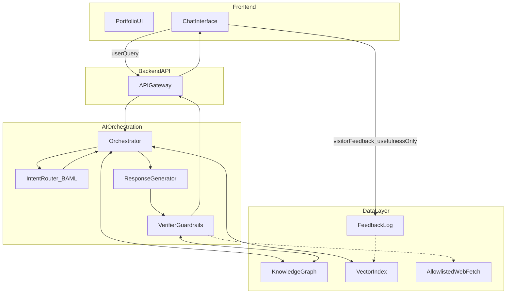
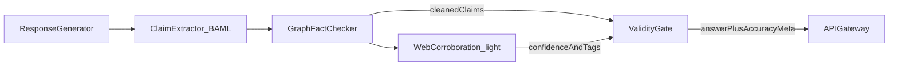

# Architecture Overview

Living spec for an intent-routed portfolio AI assistant. This document is the entry point; details live in the sibling specs.

Reference diagram from the initial design session (four layers: Frontend → Backend/API → AI Orchestration → Data).

## Stack defaults

| Layer | Choice |
| --- | --- |
| Frontend | Next.js (App Router), TypeScript, Tailwind, shadcn/ui |
| API / orchestration | Python FastAPI + BAML (+ LangChain/LangGraph-friendly) |
| Structured I/O | BAML schemas (strict typed outputs) |
| Knowledge graph (v0) | File/SQLite graph seed; Neo4j later |
| Vectors (v0) | Local Chroma; pgvector later |
| Quotas (v0) | In-process sliding window + multi-id visitor key; Redis later |
| Persona | Rebecca’s portfolio — engineering + projects + electronic music / mixes |
| LLM | Provider-agnostic interface with mock/offline fallback |
| Validity | Machine-checked (Stages A + B); visitor thumbs are usefulness-only |

## Four-layer system

## Request path

1. Visitor sends a query from the chat UI.
2. API gateway applies identity + quota checks, then hands off to the orchestrator.
3. Intent router (BAML) classifies the query and extracts slots.
4. Orchestrator runs the specialized handler: graph traversal and/or vector retrieval (and media catalog when relevant).
5. Response generator drafts an answer **only** from retrieved context.
6. Verifier runs the **validity stack** (see below), then returns answer + accuracy metadata.
7. Separately, optional thumbs feedback logs **usefulness** — never factual correctness.

## Validity stack (summary)

Correctness does not depend on visitors knowing the topic.

- **Stage A (always on):** claim ledger → graph fact check → strip/rewrite contradictions and ungrounded hard claims.
- **Stage B (light touch):** allowlisted web corroboration on high-stakes intents → `web_accuracy_confidence` / blended `accuracy_confidence`. Graph still wins on conflicts. Offline/mock → `null` and skip Stage B.

Details: [safety.md](./safety.md).

## Spec map

| Doc | Topic |
| --- | --- |
| [intents.md](./intents.md) | Intent catalog, BAML shape, handlers |
| [data.md](./data.md) | Graph, vectors, hybrid retrieval, telemetry |
| [safety.md](./safety.md) | Prompt defenses, Stages A/B, feedback role |
| [quotas-identity.md](./quotas-identity.md) | Visitor keys, RPM/TPM, Stage B budget |
| [api.md](./api.md) | Endpoint sketches |
| [roadmap.md](./roadmap.md) | Implementation milestones |
