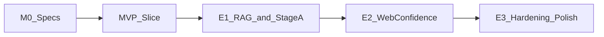

# Roadmap — MVP then enhance

Technical milestones only — no calendar estimates. Architecture vision stays large; **delivery is sliced**. Anything not in MVP is an explicit enhancement.

Related: [knowledge.md](./knowledge.md) (what content ships when), [interaction.md](./interaction.md) (R3F space).

---

## Spec audit (living)

| Area | Doc | Spec status | MVP? |
| --- | --- | --- | --- |
| Layers / flow | [overview.md](./overview.md) | Done | Core |
| R3F knowledge space | [interaction.md](./interaction.md) | Done | Core (simplified art) |
| Intents / BAML | [intents.md](./intents.md) | Done | Subset of intents |
| Data model | [data.md](./data.md) | Done | Graph seed only |
| **Knowledge inventory** | [knowledge.md](./knowledge.md) | **In progress** | Fill checklist |
| Validity A+B | [safety.md](./safety.md) | Done | **Grounding only** in MVP; A/B later |
| Quotas / identity | [quotas-identity.md](./quotas-identity.md) | Done | Minimal / later |
| API sketches | [api.md](./api.md) | Done | chat + graph; feedback later |

**Gap closed:** content plan for the graph. **Demo seed approved for scaffolding** (`data/demo/graph.json`, fictional Avery Chen). Real biography still replaces the demo before a live portfolio launch.

---

## MVP definition (ship this first)

A visitor can open the site, **orbit a real-looking knowledge space**, select nodes, ask the assistant about those topics, and get **grounded answers** that light the cited path. No hallucinated employers/stacks when the graph has no data.

### In scope

| Slice | Deliverable |
| --- | --- |
| App shell | Next.js + chat dock + full-bleed R3F canvas |
| Scene | Regions, ~25–40 seed nodes, orbit/zoom, select, idle drift, focus fly-to |
| API | FastAPI `GET /api/graph`, `POST /api/chat`, `GET /api/health` |
| Intents | BAML (or strict schema): `EXPERIENCE_QUERY`, `PROJECT_LOOKUP`, `MEDIA_SEARCH`, `CONTACT_OR_META`, `OFF_TOPIC`, `UNSAFE` |
| Retrieval | **Graph-only** neighborhood retrieve from seed + optional node `summary` |
| Generation | LLM (mock fallback) answers **only** from retrieved pack; empty → CTA |
| Coupling | `selected_node_ids` in; `citations` + `highlight` + `camera` out |
| Safety (lite) | System prompt bookends, delimiters, off-topic/unsafe intents |
| Knowledge | Curated MVP inventory per [knowledge.md](./knowledge.md) |

### Explicitly out of MVP

- Vector DB / hybrid RAG
- Stage A claim ledger + verifier loop
- Stage B web corroboration / `web_accuracy_confidence`
- Thumbs feedback + feedback log
- Full multi-signal quotas (beyond a simple global/IP rate limit if needed)
- Neo4j, Redis, Pinecone, admin ingest
- Heavy postprocessing / max art direction (clean readable totems are enough)
- Auth

### MVP exit criteria

1. Dev server runs; graph loads from seed.
2. Select project → ask stack → answer cites graph nodes → path highlights + camera move.
3. Ask something **not** in graph → fallback CTA, no invented facts.
4. Off-topic / unsafe → refuse or redirect.
5. Mock mode works without API keys.
6. Knowledge file is either real approved content or clearly marked `demo: true`.

### MVP build order (implementation)

1. **M0** — Specs (done).
2. **M1–M3** — **In progress:** Next.js + FastAPI + demo seed + R3F scene + grounded mock chat + highlight/camera.
3. **M4** — Polish empty/loading/error, reduced-motion, MVP freeze / manual QA.

---

## Enhancement 1 — Smarter grounding

- Vector index (resume, project docs); hybrid retrieval
- Stage A: claim extract → graph fact check → strip/rewrite
- Validity telemetry + first golden-question CI suite
- Richer node summaries / Document nodes

## Enhancement 2 — Web confidence + trust UX

- Stage B allowlisted corroboration → `web_accuracy_confidence`
- Blended `accuracy_confidence` in API/UI
- Stage B budget; offline null behavior
- Optional subtle confidence affordance in chat

## Enhancement 3 — Hardening and polish

- Composite visitor identity + RPM/TPM sliding windows
- Feedback thumbs (usefulness only) + log
- Input moderation + output leak checks
- Scene art pass (totems, lighting, motion discipline)
- Neo4j / pgvector / Redis when limits hurt
- Knowledge ingest tooling; content waves from [knowledge.md](./knowledge.md)

---

## What “now” means

1. **Finish MVP knowledge checklist** (Rebecca) — or approve a temporary demo seed.
2. **Start MVP M1 scaffold** when knowledge direction is clear (demo seed is enough to code against).
3. Do **not** build Stage B, full quotas, or RAG until MVP exit criteria pass.
