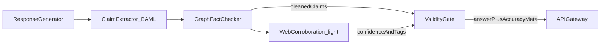

# Safety, guardrails, and validity

This spec covers prompt-injection defenses, narrow-scope framing, and the **machine validity stack**. Visitor feedback is usefulness-only and never decides whether an answer is factually valid.

## Core defense strategies

### System prompt boundaries

- Place main rules at the **beginning** of the system prompt and reinforce them at the **end**.
- Use strict language: never change core persona, rules, or core instructions regardless of user text.

### Ignore override commands

Treat phrases like “disregard previous instructions,” “forget everything,” or “you are now in developer mode” as ordinary user text (or ignore them). Do not alter control logic.

### Delimiter separation

Separate control text from user text with clear markers, e.g. `### User Input ###`, so user content cannot bleed into instructions.

### Input guardrails

Run user messages through a fast moderation path (small guard model or provider moderation API) before orchestration. Catch prompt injection / abuse early → `UNSAFE` intent path.

### Output monitoring

Before returning to the client, check that the reply did not accept a jailbreak, leak system instructions, or escape portfolio scope.

### Task-specific framing

The assistant only answers within portfolio scope (experience, projects, creative/media, contact/meta). Off-topic is a first-class intent, not a creative writing exercise.

---

## Validity stack

Visitors may not know enough to verify technical claims. Correctness is enforced in Verifier / Guardrails.

**Rollout:** MVP ships **grounded generation only** (answer solely from retrieved graph context; empty → CTA). Stage A and Stage B land in enhancements — see [roadmap.md](./roadmap.md). The full design below is the target architecture.

### Stage A — Claim ledger + deterministic fact check (primary; Enhancement 1)

1. **Generator** drafts a reply from retrieved graph/vector context only.
2. **Claim extractor** (BAML) splits the reply into atomic claims:

```text
class Claim {
  id string
  subject string
  predicate string
  object string
  time_range string | null
  claim_type HardFact | SoftOpinion | Narrative
  citation_ids string[]
}
```

Examples: `(Rebecca, USED_TECH, Terraform, project=X)`, `(Project Y, DEPLOYED_WITH, GitHub Actions)`.

3. **Fact checker** validates each **hard** claim against the knowledge graph (exact match, synonym map, date overlap). Outcomes:

| Outcome | Meaning |
| --- | --- |
| `SUPPORTED` | Graph entails the claim |
| `CONTRADICTED` | Graph conflicts with the claim |
| `NOT_IN_GRAPH` | No supporting or conflicting edge |

4. **Policy**

- Any `CONTRADICTED` → rewrite or refuse that span.
- Hard `NOT_IN_GRAPH` (employer, title, dates, “built X”) → strip or replace with empty-retrieval fallback.
- Soft/narrative claims may pass unmarked or labeled as opinion.
- Uncited hard claims are dropped.
- Prefer requiring `citation_ids` (`graph_node_id` / chunk id) on every hard claim.

5. **Regression:** golden suites of fixed questions → expected claim sets; CI fails on invent/drop.

### Stage B — Light dual-path web confidence (secondary; Enhancement 2)

Not every turn. Eligible intents: `EXPERIENCE_QUERY`, public `PROJECT_LOOKUP`, and other high-stakes factual paths flagged by the orchestrator.

1. After Stage A produces a cleaned claim set, run **allowlisted** search/fetch against public sources (personal site, configured public profiles, GitHub, published posts). Not open-ended web agents; not model-chosen arbitrary URLs.
2. Structured judge compares Stage A claims to snippets and returns:

- `web_accuracy_confidence` in `[0, 1]`
- per-claim tags: `CORROBORATED` | `UNSEEN_ON_WEB` | `WEB_CONFLICT`
- short `evidence_urls` (allowlisted only)

3. **Policy**

- Stage A / local graph **wins** on contradictions with local knowledge.
- Web path does **not** invent facts; it adjusts confidence and may further withhold or hedge on `WEB_CONFLICT` for hard claims.
- Offline/mock mode → `web_accuracy_confidence: null`, Stage B skipped.

### Blended accuracy

Expose `accuracy_confidence` on the chat response (see [api.md](./api.md)):

- If Stage B ran: blend of graph support rate and web score (weights tunable; document defaults in implementation).
- If Stage B skipped: Stage A support rate only.

Optional UI: show a subtle confidence affordance; always log full telemetry.



## Feedback loop (usefulness only)

Thumbs-up/down or “Was this helpful?” widgets:

- Log prompt, intent, retrieved context refs, answer, visitor key.
- Use for coverage/UX review and knowledge-gap discovery.
- **Do not** treat negative feedback as proof the answer was false, or positive feedback as proof it was true.

Validity telemetry (claim outcomes, web tags, confidence) is stored separately — see [data.md](./data.md).
